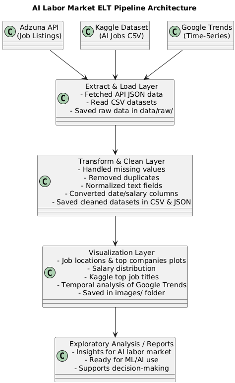

# AI Labor Market ELT Pipeline

## Setup Instructions

Follow these steps to set up and run the AI Labor Markets ELT Pipeline:

### 1. Clone the Repository
```bash
git clone https://github.com/your-username/AI_Labor_Market_ELT.git
cd AI_Labor_Market_ELT
```

### 2. Create a Virtual Environment
Use a virtual environment to manage dependencies.

```bash
python -m venv venv
```

### 3. Activate the Virtual Environment

**Windows:**
```bash
venv\Scripts\activate
```

### 4. Install Required Dependencies

```bash
pip install -r requirements.txt
```

Your `requirements.txt` should include:

```
pandas
numpy
requests
python-dotenv
matplotlib
seaborn
pytrends
```

### 5. Set up Environment Variables (.env File)

Create a file named `.env` in the project root directory and add your Adzuna API credentials:

```
ADZUNA_APP_ID=your_adzuna_app_id
ADZUNA_APP_KEY=your_adzuna_app_key
```

### 6. Run the Pipeline

Execute the main pipeline script:

```bash
python run_pipeline.py
```

This will:
- Extract data from Adzuna API, Kaggle dataset, and Google Trends
- Store raw data in `data/raw/`
- Clean and transform the datasets
- Save processed data in `data/cleaned/`
- Generate visualizations in the `images/` folder


#Quetion sanswer
Bwloq is the Pipeline architecture diagram.


## Part 1 Questions

### (a) Data Heterogeneity
In this assignment, I integrated three different data sources, each representing different data types:

1. **Adzuna API (Unstructured / Semi-structured data):**  
   The job listings retrieved from the Adzuna API included textual job descriptions, titles, locations, and salary ranges. While some fields like `salary_min`, `salary_max`, and `location` are structured, the `description` field is unstructured, containing variable formatting and HTML tags.

2. **Kaggle Dataset (Structured data):**  
   The Kaggle dataset contained structured tabular data on AI job market trends, including columns like `Job Title`, `Company`, `Location`, and `Posted Date`. This dataset was easy to load directly into a Pandas DataFrame due to its consistent CSV format.

3. **Google Trends Data (Time-series data):**  
   Using the pytrends library, I extracted search interest data over time for keywords like "AI jobs" and "Machine learning careers". This represents a semi-structured time-series format where the index is dates and the values are search interest scores, useful for temporal analysis of job popularity.

These heterogeneous data types demonstrate how real-world ELT pipelines must handle structured, semi-structured, and unstructured data simultaneously.

---

### (b) Extraction Challenges
During the extraction phase, several technical and practical challenges were encountered:

1. **Adzuna API:**  
   - It required an App ID and App Key for authentication.  
   - The API rate limits restricted the number of requests per hour, so pagination and careful looping were done to avoid being blocked.  
   - Unstructured job descriptions sometimes contained HTML tags or inconsistent formatting, which needed cleaning.

2. **Kaggle Dataset:**  
   - Initially, issues with file paths occurred, as the CSV needed to be placed in the correct `data/raw/` folder for the pipeline to load correctly.  
   - Some datasets included missing values and inconsistent column naming, requiring normalization and cleaning.

3. **Google Trends:**  
   - In this, requests had to be rate-limited to avoid temporary blocking.  
   - The time-series data for multiple keywords had different start and end dates.

Overall, handling these challenges required careful attention to authentication, rate limits, and data consistency.

---

### (c) Storage Justification
Storing the extracted data in **multiple formats (CSV and JSON)** provides flexibility for both human readability and machine processing:

- **CSV (Comma-Separated Values):**  
  - It is ideal for structured tabular data such as Kaggle datasets or cleaned job listings.  
  - It is easy to read in spreadsheet applications and widely supported for simple analyses.

- **JSON (JavaScript Object Notation):**  
  - It is best for semi-structured or nested data, like raw Adzuna job listings, which contain nested dictionaries and lists.  
  - It retains the full hierarchical structure, making it easier to process programmatically without flattening.

**When to choose one over the other:**  
- **CSV** should be used when you need a simple, flat, tabular representation for analytics or sharing with non-technical users.  
- **JSON** should be used when preserving nested structures, metadata, or semi-structured information is important for downstream processing or machine learning applications.

By storing both, the pipeline ensures maximum flexibility for exploratory analysis, reporting, and AI/ML model development.


## Part 2 Questions

### (a) Cleaning Rationale
For this assignment, I applied careful data cleaning and transformation steps to ensure the datasets were reliable and consistent for analysis:

1. **Adzuna Jobs Dataset:**  
   - **Duplicates removed:** I eliminated duplicate job postings to avoid inflating counts in analysis.  
   - **Missing values handled:** I replaced missing company or location names with `"Unknown"` to retain all rows, while missing salary values were set to `0` to allow numeric analysis without causing errors.  
   - This approach ensures that we do not lose data unnecessarily while maintaining consistency for plotting and aggregation.

2. **Kaggle AI Jobs Dataset:**  
   - **Duplicates removed:** I dropped repeated entries.
   - **Salary cleaned:** I converted the `Salary_USD` column to numeric, with invalid entries coerced to NaN. I filled the missing salaries using the **median**, as it is less sensitive to outliers than the mean.  
   - **Text normalization:** I converted text columns such as `Job_Title`, `Industry`, and `Location` to lowercase and stripped extra whitespace to standardize entries, which makes aggregations and visualizations more accurate.

3. **Google Trends Dataset:**  
   - **Duplicates removed:** I ensured no repeated records skewed the analysis.  
   - **Missing values filled:** I replaced all NaNs with `0`, which is reasonable for search interest data.  
   - **Date conversion:** I converted the `date` column to a datetime format to support temporal visualizations.

Overall, these cleaning steps were chosen to balance data integrity with usability, enabling meaningful analysis and visualizations without introducing biases from missing or inconsistent values.

---

### (b) Visualization Insights
The visualizations provided several insights into the AI labor market:

1. **Job Locations and Companies (Adzuna Dataset):**  
   - The bar plots of top locations and companies show that AI jobs are concentrated in a few key cities and organizations.  
   - This indicates regional and corporate clustering in AI hiring trends.

2. **Salary Distribution (Adzuna Dataset):**  
   - The histogram of minimum and maximum salaries highlights that while most jobs offer modest salaries, a small number of positions offer significantly higher pay.  
   - This distribution indicates a wide range of compensation in the AI job market.

3. **Top Job Titles (Kaggle Dataset):**  
   - A bar plot of the most common job titles reveals which roles are in highest demand, such as "machine learning engineer" or "data scientist".  
   - This helps identify skill requirements and trending positions.

4. **Temporal Trends (Google Trends Dataset):**  
   - Time-series plots of search interest for AI-related terms show peaks in popularity, which often correspond to market trends or recruitment drives.  
   - This demonstrates how public interest in AI careers fluctuates over time.

These insights together provide a multi-faceted view of the AI labor market, combining demand, salary, and temporal patterns.

---

### (c) Visualization Critique
While the current visualizations are informative, there are some limitations:

1. **Scope:**  
   - The visualizations only highlight the top 10 locations, companies, or job titles, which may overlook smaller but emerging trends.  

2. **Audience Considerations:**  
   - The plots are suitable for technical audiences who can interpret bar charts and histograms, but business stakeholders might prefer summary tables, dashboards, or interactive visualizations.  

3. **Data Granularity:**  
   - Salary distribution plots do not account for job level or experience, which could provide more nuanced insights.  
   - Google Trends visualizations show overall interest but cannot distinguish between genuine job seekers and casual search traffic.

---


